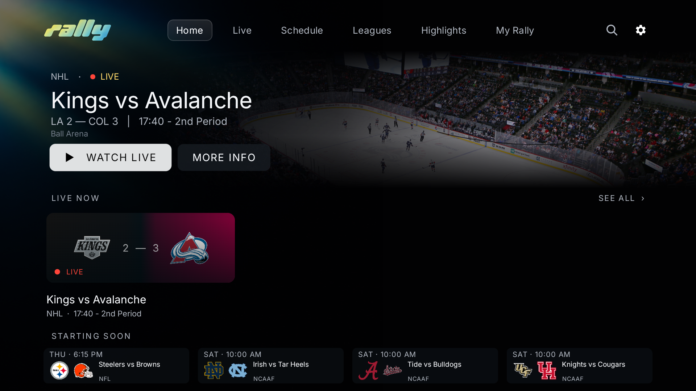
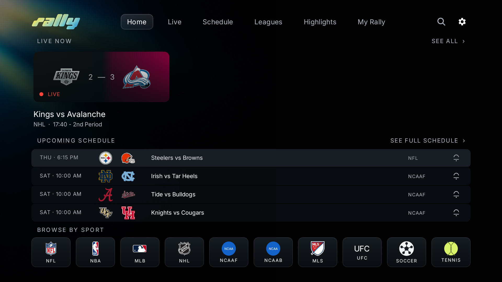
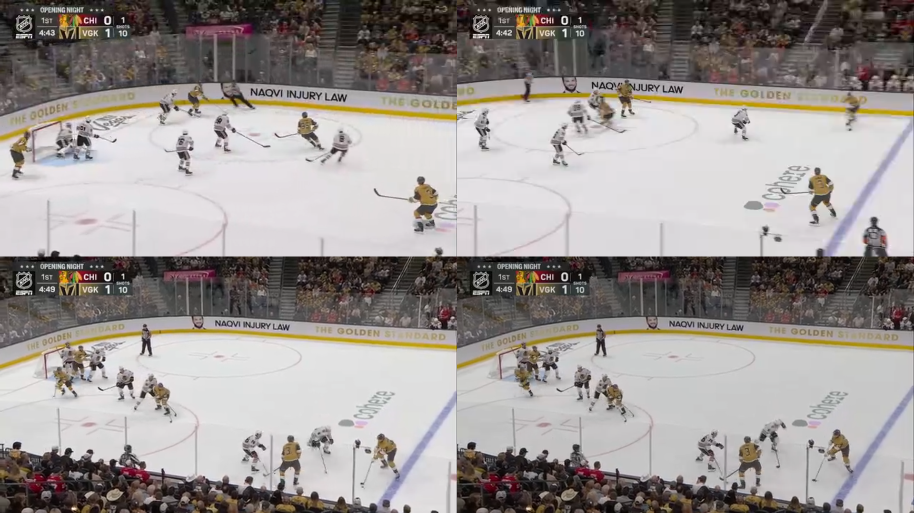
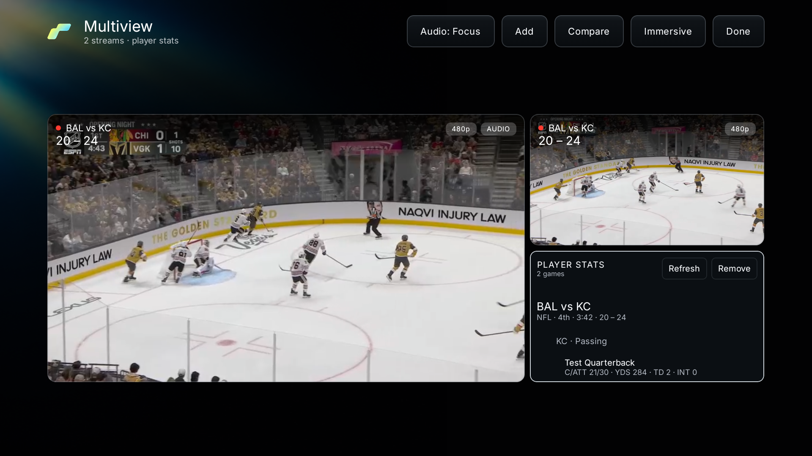
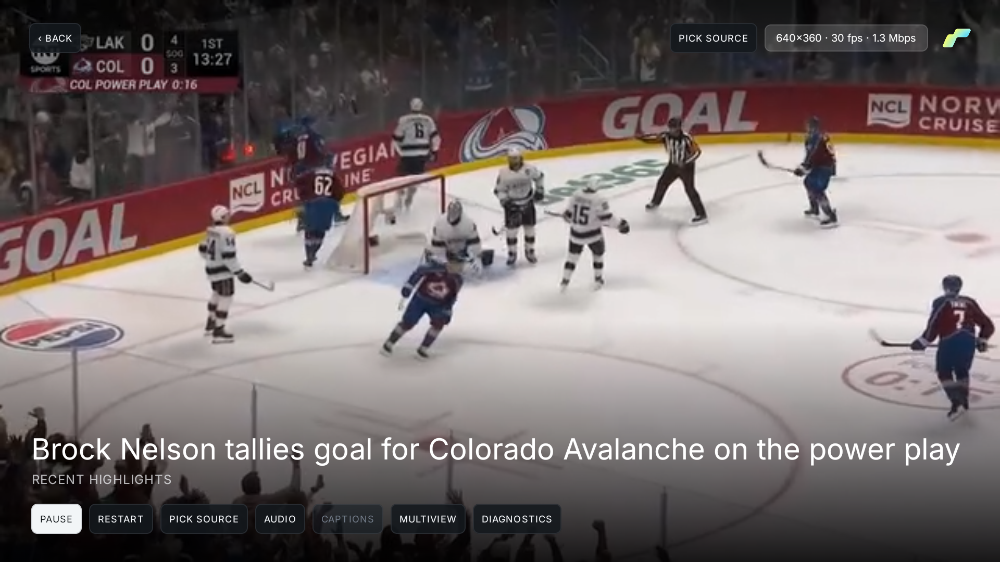

# Rally Android TV redesign audit — September 30, 2026

## Verification

- 88 unit tests passed; lint reported zero errors and 113 warnings, mostly existing unused resources, icons, and build-tool checks.
- Six navigation/playback tests passed on the emulator in 96.5 seconds and on a physical Chromecast (sabrina, Android 14, 1920×1080) in 207 seconds.
- No crashes were recorded during either suite or the separate optimized-build navigation and real highlight-playback checks.
- The optimized QA build was installed on both devices. The temporary hardware test package was removed from the Chromecast afterward.

### Coverage

Home top/guide/return, Live and Live TV entry, Schedule filters, Leagues and standings, Highlights, My Rally/team views, Search, Settings access, event tabs, watchlist callbacks, and onboarding were checked where current data allowed them.

Player checks cover remote access to stats tabs and a 25-player list, play/pause, restart, fullscreen/game view, audio, available captions, source selection, and diagnostics.

Multiview checks cover actual video rendering in two and four panes, 16:9 frames, 50/50 and 70/30 layouts, focused/pinned audio selection, comparison, source selection, remote menu removal, Player Stats tiles, player details, and RedZone/duplicate-game aggregation.

Playback/multiview test repositories use controlled games and box scores with actual public sports video. The NHL footage under NFL fixture labels in these test screenshots is intentional and is not shipping content. Audio checks verify routing and focus selection, not a recording of the TV's speaker output.

## Screenshots

| Home at the top | Expanded Home schedule |
| --- | --- |
|  |  |

| Four video panes, immersive | Streams with player stats |
| --- | --- |
|  |  |

## Remaining release checks

**Home animation performance needs further optimization.** Six warmed top/guide cycles on the Chromecast recorded 70 delayed frames out of 329 (21.28%), a 32 ms median and a 53 ms 90th percentile. Mixed navigation/playback recorded 338 delayed frames out of 893 (37.85%), a 22 ms median and a 42 ms 90th percentile. This build has not passed a consistently smooth animation gate.

The emulator uses ANGLE/Vulkan SwiftShader software graphics, so its frame timing does not establish hardware animation performance.

Sustained four-stream playback, provider-specific sources and interruptions, network recovery, and thermal behavior need a longer endurance run. Live Sunday RedZone coverage was not observed; aggregation was tested with controlled fixtures. The slate covers NFL kickoffs from 1 PM through 5:59 PM Eastern and excludes canceled games. Generic channels without reliable matchup/EPG information cannot identify their game automatically.

External account setup, system file pickers, notification delivery, and update installation were not exercised end to end. Production signing remains separate from the locally signed QA APK; build products and private signing/provider data are not committed.

[Chromecast results](chromecast-results.json) · [Emulator results](emulator-results.json)
